```mermaid
%%{init: {
  'flowchart': { 'useMaxWidth': false, 'htmlLabels': true },
  'theme': 'default',
  'themeVariables': {
    'fontSize': '20px',
    'fontFamily': 'Inter, system-ui, -apple-system, sans-serif',
    'subgraphFontSize': '24px',
    'labelFontSize': '18px'
  }
}}%%
graph LR
    %% Data Ingestion Phase
    subgraph Data_Ingestion_Pipeline [Data Ingestion & Indexing Pipeline]
        A[5 Official AMC Website URLs] --> B[Web Scraper - requests + BeautifulSoup]
        B --> C[HTML Cleaner - strip nav/footer/scripts]
        C --> D[Text Chunker + Metadata Tagger]
        D --> E[Embedding Generator - Gemini API]
        E --> F[(ChromaDB Vector Store)]
    end

    %% User Query & RAG Pipeline
    subgraph Query_RAG_Pipeline [Query & RAG Processing Pipeline]
        G[User Interface / Web Client] --> H[PII Sanitizer]
        H --> I[Intent Classifier]

        %% Intent Branching
        I -->|Subjective / Advisory| J[Refusal Handler]
        I -->|Objective / Factual| K[Context Retriever]

        %% Refusal Flow
        J --> L[Polite Refusal + Educational Link]

        %% Factual Flow
        K -->|Query Embedding| F
        F -->|Top-K Chunks + Metadata| K
        K --> M[Prompt Builder + Guardrails]
        M --> N[Gemini LLM Inference]
        N --> O[Format: 3 Sentences + Citation + Footer]
    end

    %% Response Delivery
    L --> P[Final Response to UI]
    O --> P
    P --> G

    %% Styling classes
    classDef nodeStyle font-size:20px,font-weight:bold,stroke-width:2px;
    class A,B,C,D,E,F,G,H,I,J,K,L,M,N,O,P nodeStyle;

    %% Styling
    style Data_Ingestion_Pipeline fill:#f5f7fa,stroke:#cbd5e1,stroke-width:2px
    style Query_RAG_Pipeline fill:#f0f9ff,stroke:#bae6fd,stroke-width:2px
    style F fill:#e2e8f0,stroke:#64748b,stroke-width:2px
```

# Groww Mutual Fund RAG Assistant - System Architecture

This document describes the architectural design of the **Groww Mutual Fund RAG Assistant**, detailing the data flow, component layout, guardrails, and query processing pipelines.

---

## 1. System Architecture Map

The diagram below illustrates the end-to-end flow of data and queries within the system.

---

## 2. Key Components

### 2.1. Data Ingestion & Indexing Pipeline
This pipeline prepares the knowledge base before the assistant serves queries.
* **Web Scraper:** Fetches HTML content from 5 official mutual fund scheme URLs provided manually. Uses `requests` with browser-like headers to avoid bot blocks. No PDF downloads — data is scraped directly from live web pages.
* **HTML Cleaner:** Uses `BeautifulSoup` to parse the HTML, stripping navigation bars, footers, scripts, ads, and cookie banners. Only the meaningful body content (scheme facts, tables, paragraphs) is retained.
* **Chunking Strategy:** Splits cleaned text into overlapping character-based chunks (700 chars, 100-char overlap) to ensure context continuity across semantic boundaries.
* **Metadata Association:** Each chunk carries:
  - `source_url`: Exact URL of the originating page.
  - `scheme_name`: Mutual fund scheme name.
  - `doc_type`: Type of page (e.g., "scheme-page", "faq", "factsheet").
  - `scraped_at`: Timestamp of when the page was fetched.
* **Vector Database:** Chunks are embedded via the **Gemini Embedding API** and stored in a local persistent **ChromaDB** instance for fast semantic retrieval.

### 2.2. PII Sanitizer
All user queries pass through a middleware layer before any processing:
* Detects and blocks queries containing PAN numbers, Aadhaar, account numbers, OTPs, email addresses, or phone numbers.
* Responds with a short, compliant message if PII is detected.

### 2.3. Intent Classifier
* **Factual:** Objective, verifiable queries (expense ratio, exit load, SIP minimum, lock-in period).
* **Advisory:** Subjective or comparative queries ("Should I invest?", "Which fund is better?").

### 2.4. Context Retriever & LLM Guardrails
If classified as **Factual**:
1. Query is embedded and semantically searched against ChromaDB.
2. Top-3 most relevant chunks are retrieved with their source metadata.
3. A strict system prompt is assembled for the LLM enforcing:
   - Max 3 sentence response.
   - Exactly one citation link (from retrieved metadata).
   - Mandatory footer: `Last updated from sources: <date>`.

### 2.5. Refusal Handler
If classified as **Advisory**:
1. Vector retrieval is bypassed entirely.
2. A polite, compliant refusal message is returned.
3. An educational link (SEBI / AMFI investor education) is appended.

### 2.6. User Interface (UI)
A clean, premium web client:
* Prominent facts-only disclaimer.
* Three pre-loaded suggested questions.
* Chat interface with citation badges and "last updated" footers on each answer.

---

## 3. Strict Compliance Guardrails

1. **Response Length:** Hard cap of 3 sentences enforced at application layer.
2. **Citation Validation:** Response URL must match a URL from the retrieved chunk metadata.
3. **PII Firewall:** Input scrubbed before LLM or vector DB access.
4. **Advisory Post-Filter:** Any advisory language in LLM output triggers a full response replacement with a standard refusal.
